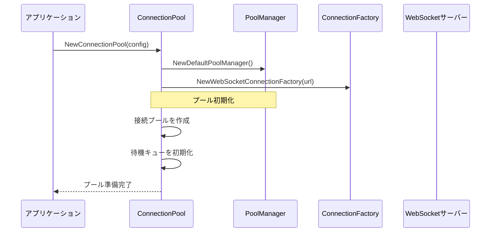
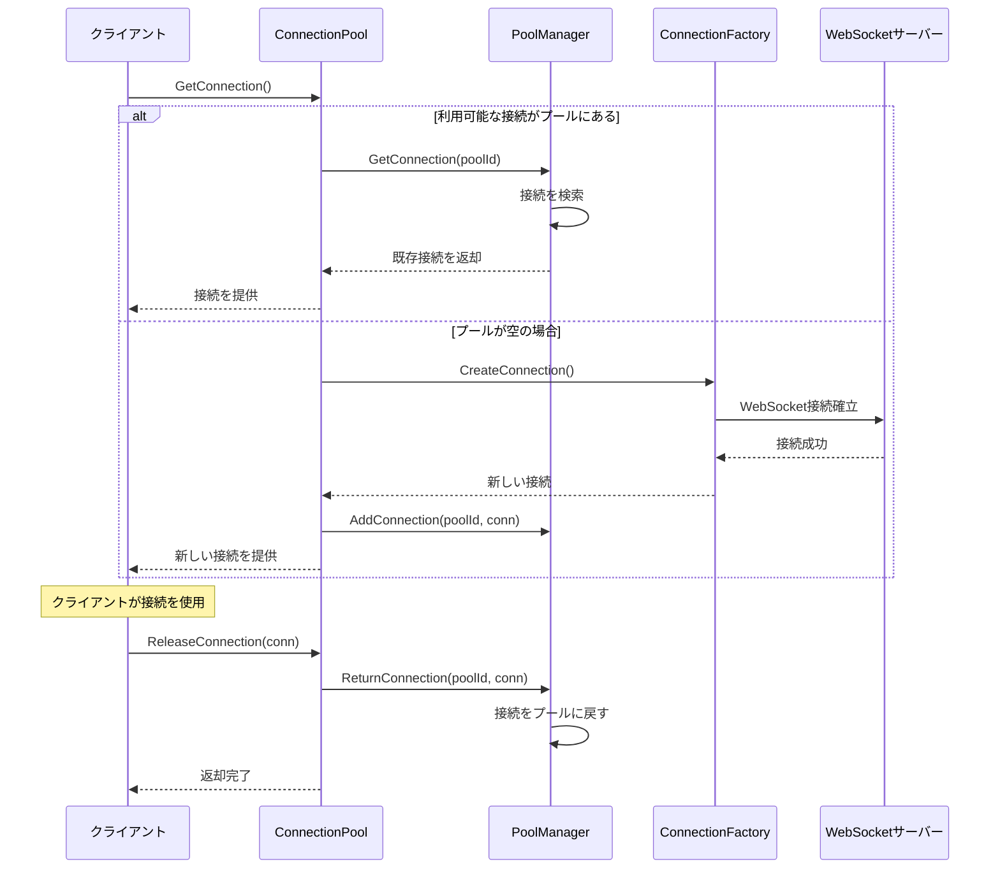
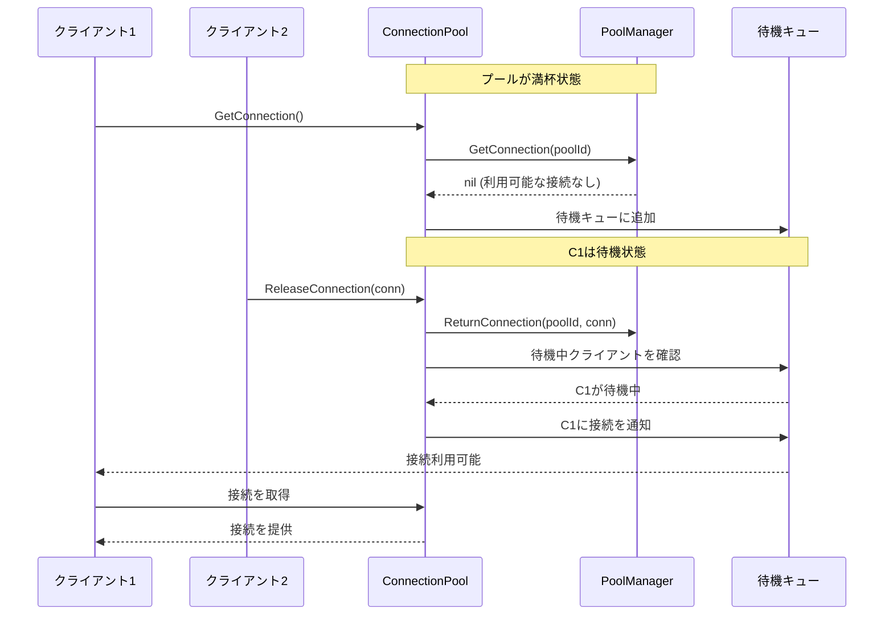
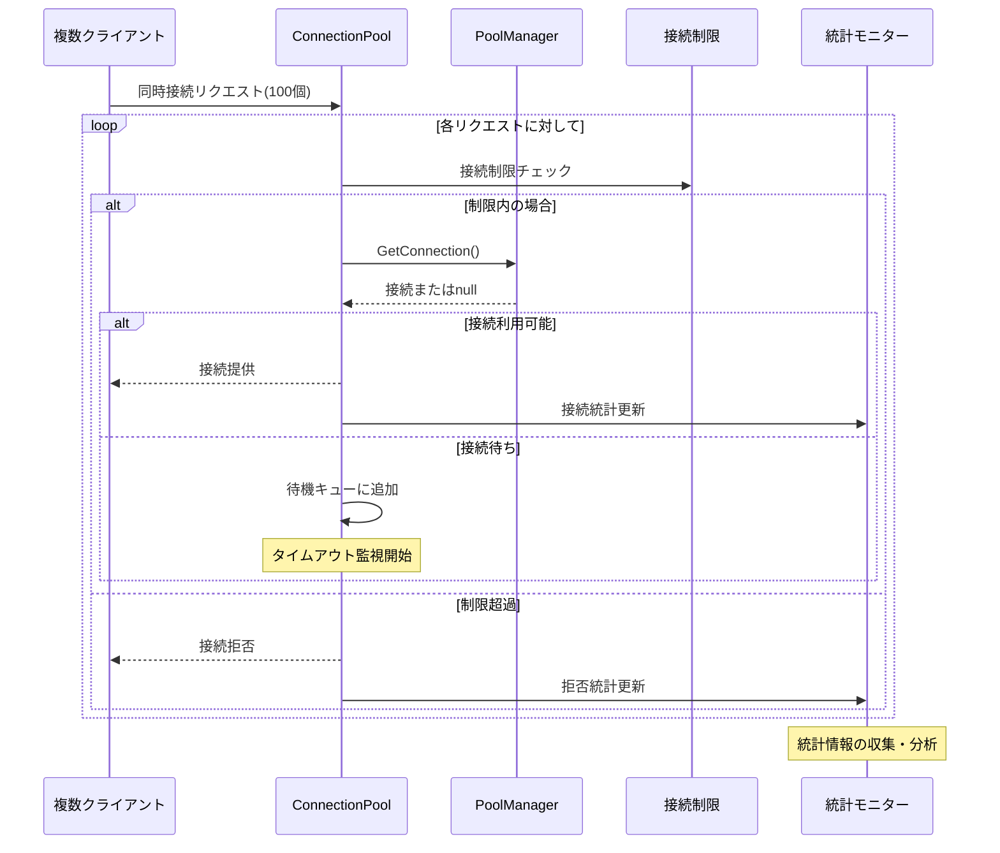
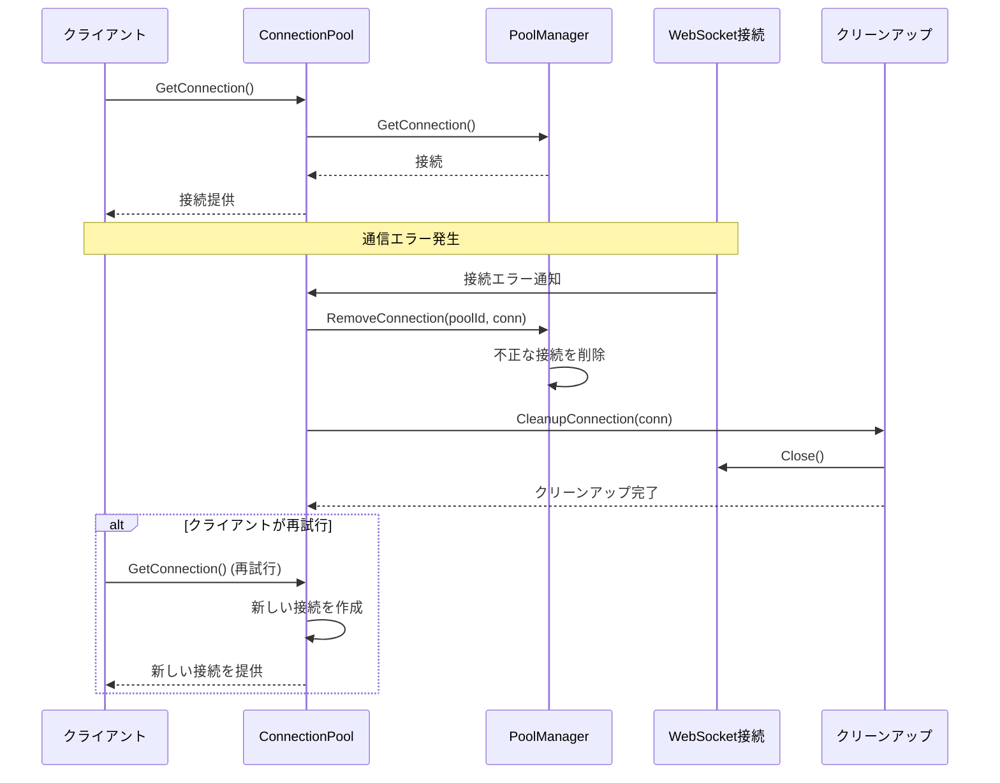
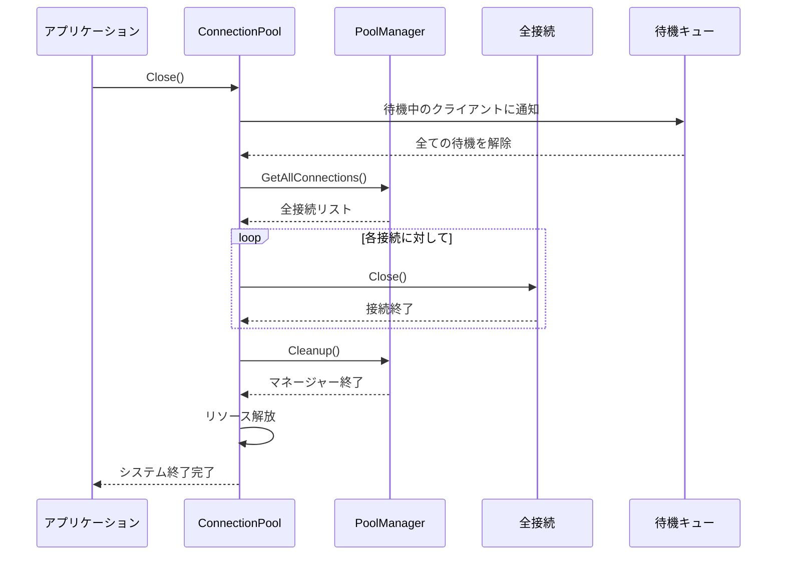

# システムシーケンス図

このドキュメントでは、WebSocket接続プールシステムの動作フローをシーケンス図で説明します。

## 1. 接続プール初期化シーケンス

## 2. 通常の接続取得・返却シーケンス

## 3. 接続待機システムシーケンス

## 4. 高負荷時の制御フローシーケンス

## 5. エラーハンドリング・クリーンアップシーケンス

## 6. システム終了時のクリーンアップシーケンス

## アーキテクチャー概要

このシステムは以下の主要コンポーネントで構成されています：

- **ConnectionPool**: メインオーケストレーター、待機システム管理
- **PoolManager**: 実際の接続プール管理、スレッドセーフ
- **ConnectionFactory**: WebSocket接続の作成を抽象化
- **統計システム**: パフォーマンス監視と分析
- **クリーンアップシステム**: リソース管理と終了処理

各コンポーネントは疎結合で設計されており、Clean Architectureの原則に従って実装されています。
